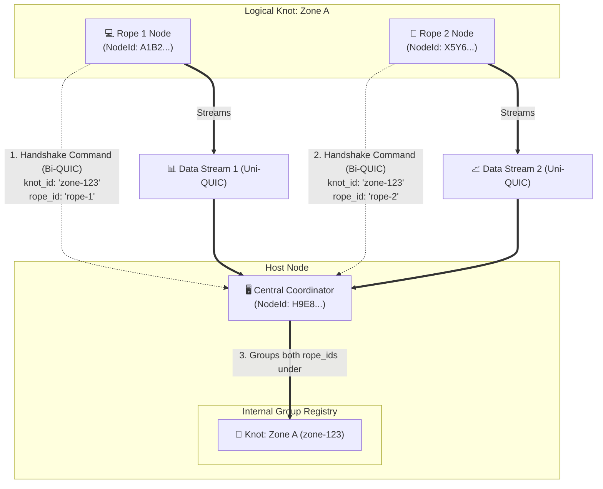
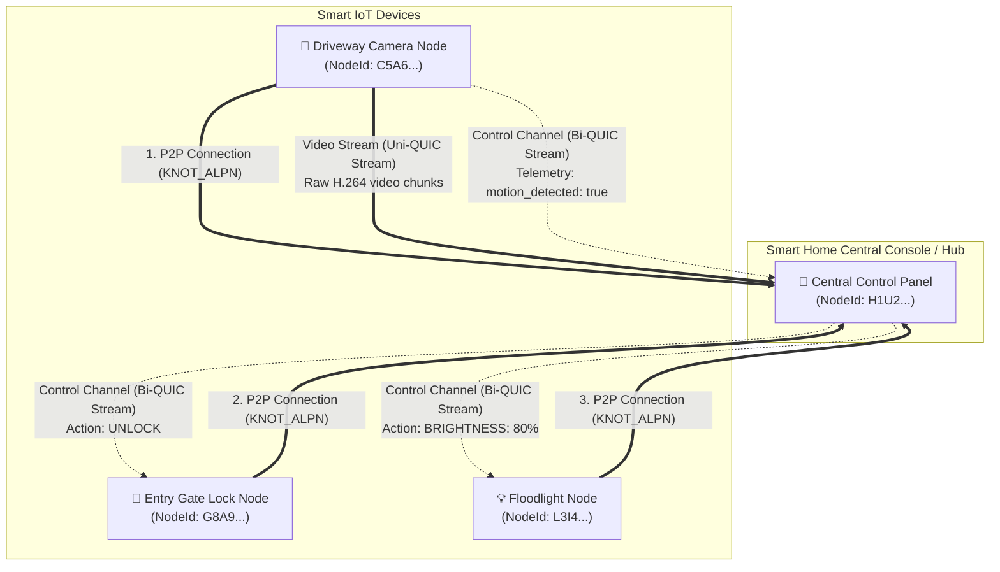
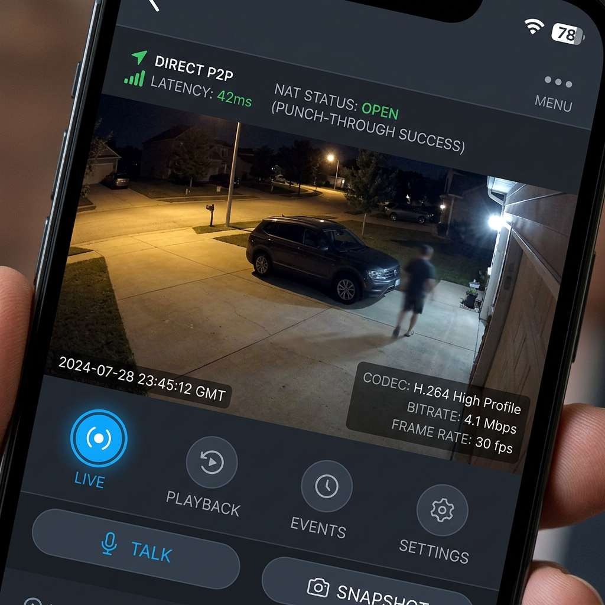
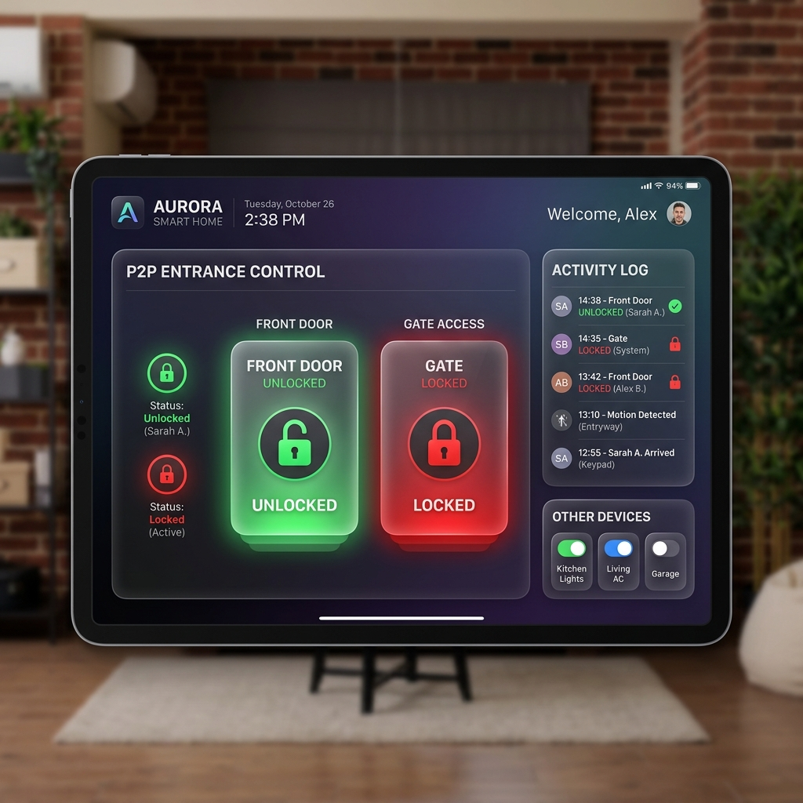
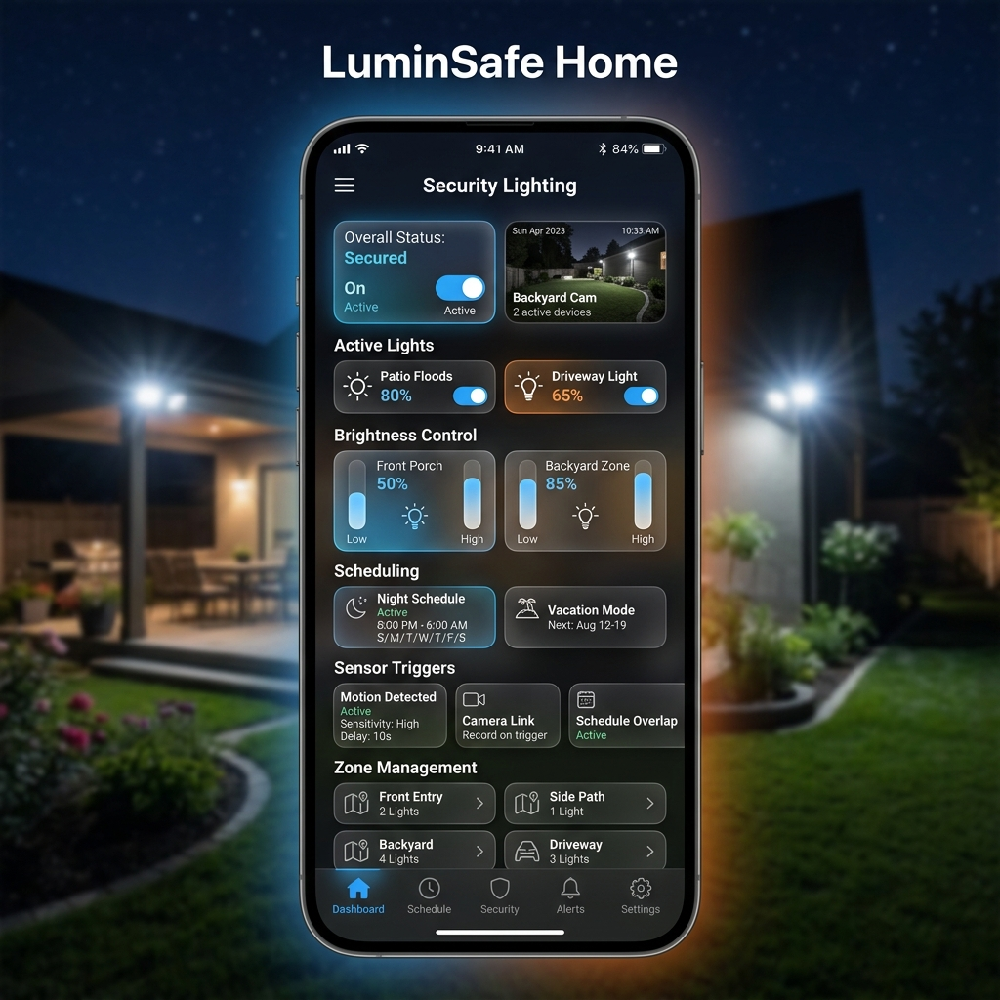

# Knot Protocol 🪢

| Protocol Status | Reference Implementation | Conformance Suite | Transport |
| :--- | :--- | :--- | :--- |
| **v1 draft** | **Rust** | **8 passing tests** | **Iroh (first transport adapter)** |

> [!NOTE]
> This is the **Knot v1 draft protocol preview**. It is currently in active design/refinement and is not yet designated as production-ready.

The **Knot Protocol** is a peer-to-peer (P2P) orchestration protocol designed to be completely transport-agnostic, with **Iroh** as the first/default transport adapter. It allows coordinating multiple distributed physical nodes (**Ropes**) under a single logical identity (**Knot**) connected to a central host. It provides a bidirectional control channel for structured event routing and dynamically allocates isolated, unidirectional streams for timed binary data transport directly between peers without intermediary cloud servers. This generic abstraction unlocks the implementation of alternative transport adapters such as `tcp-knot`, `websocket-knot`, `mock-knot`, or `memory-knot` in the future.

Here is how Knot maps its coordination model directly onto Iroh's core building blocks, with a focus on how logical identities coordinate across multiple physical nodes.

---

## 🛠️ Core Concepts (Mapping to Iroh Terminology)

### 1. Nodes & Endpoints (The Ropes)
In Iroh, any device running the stack is a **Node**. Every node has an **Endpoint**, which acts as its plug into the internet.
* In Knot, each physical connection represents a **Rope**.
* Each Rope (the host station, the sensor nodes, client terminals) is an independent Iroh Node.
* Every Node has a permanent public identity called a **PublicKey** (or `NodeId`), which is a secure cryptographic hash.

### 2. Connection Tickets (Crossing Firewalls)
To establish a direct peer-to-peer connection through strict home or office routers, Knot uses Iroh's **Ticket** system:
* The host node starts up and generates a **Connection Ticket** (a short, URL-safe text string containing the host's `NodeId`, local IP addresses, and Relay server locations).
* The rope/device nodes receive this Ticket, parse it, and establish a direct P2P QUIC connection to the host, using Iroh's NAT traversal (hole punching) to bypass firewalls.

### 3. ALPN (Speaking the Same Language)
When nodes connect, they negotiate what application protocol to speak using **ALPN** (Application-Layer Protocol Negotiation):
* The Knot protocol registers the ALPN identifier `jitpomi/studio/1` (referenced as `KNOT_ALPN`).
* Only nodes that speak this exact protocol can handshake and join the session.

### 4. QUIC Streams (The Pipes Inside the Tunnel)
Once a connection is established, the nodes communicate using lightweight, isolated **QUIC Streams**:
* **Bidirectional Streams (Interactive Dialogues):**
  A two-way lane opened when a rope connects. It is used as the **Control Channel** to exchange JSON commands back and forth (e.g., handshake registration, operational commands, configuration changes, metadata updates, or control instructions).
* **Unidirectional Streams (One-Way Transfers):**
  One-way lanes opened dynamically whenever a rope publishes a stream. A sensor payload, media stream, or file transfer gets its own dedicated stream. If a data source is toggled off, its unidirectional stream is cleanly closed without affecting the main bidirectional control channel.

---

## 🤝 Logical Grouping of Physical Nodes (Ropes to Knots Coordination)

> [!IMPORTANT]
> **Physical vs. Logical Distinction:**
> * **Ropes are physical:** On the network level, only physical devices (**Ropes**) establish P2P connections via Iroh. 
> * **Knots are logical:** A **Knot** is a logical container (like a room or zone) under which one or more physical Ropes register. Knots do not connect to the network; physical Ropes connect and declare which logical Knot they belong to.

The core innovation of the Knot protocol is separating a participant's **logical identity (the Knot)** from the **physical nodes (the Ropes)** that belong to it.

Different physical ropes (nodes) are orchestrated and identified as a single logical identity (knot):
1. Physically, the different devices/sensors are independent **Iroh Nodes** with separate `NodeId`s.
2. Both devices establish their own P2P QUIC connections to the central coordinator/host.
3. Once connected, each device sends a `Handshake` message over its bidirectional control stream.
4. Both send the **same `knot_id`** (the Knot identity), but send **different `rope_id`s** (identifying the specific rope/device).

### The Multi-Device Routing Diagram:



### Why this structure matters:
* **Isolated Data Control:** The host receives raw packets from Rope 1 and Rope 2 on completely separate unidirectional QUIC streams. This allows the host to process, record, or route them independently.
* **Logical Event Coordination:** Since the host knows both ropes belong to the same logical knot, it can coordinate actions (e.g., auto-disabling a secondary sensor if the primary sensor in the same knot is already active).

---

## 🚀 Example Rust Implementation

Here is how you interact with the Knot protocol in Rust:

### 1. Joining a Session
When a rope connects, it registers its capabilities, stable rope identity, and targets a logical knot group:
```rust
use knot_protocol::{KnotClient, Capability};

let client = KnotClient::join(&ticket)
    .knot("zone-123")
    .rope_id("camera-rope")
    .join_token("secret-session-token")
    .capability(Capability::camera_h264_1080p("camera-1"))
    .endpoint(endpoint)
    .connect()
    .await?;
```

### 2. Configuring a Stream
```rust
use knot_protocol::StreamConfig;
use std::collections::HashMap;

let config = StreamConfig {
    stream_id: None, // Assigned by the engine
    capability_id: "camera-1".to_string(),
    topic: "security_feed".to_string(),
    format: "h264".to_string(),
    attributes: HashMap::from([
        ("fps".to_string(), "30".to_string()),
        ("resolution".to_string(), "1080p".to_string()),
    ]),
};
```

### 3. Streaming Timed Binary Data Chunks
Once a stream is accepted, the client can write packet frames carrying headers and payloads:
```rust
let mut stream = client.create_stream(
    "stream-1".to_string(),
    "camera-1".to_string(),
    "security_feed".to_string(),
    "h264".to_string(),
    attributes,
).await?;

let frame_type = 1; // 1 = Keyframe, 2 = Delta, 3 = Event
let timestamp_ms = 45100;
let payload = vec![0x01, 0x02, 0x03, 0x04]; // Raw binary payload

stream.write_frame(frame_type, timestamp_ms, &payload).await?;
```

---

## 💡 Example Usecase: Smart Home Security (IoT Control)

Because of its generic P2P design, Knot can be used across diverse domains. Below is a detailed example of how it can be applied to local-first **IoT and Smart Home Security Control**.

> [!TIP]
> Complete, standalone runnable examples of various topologies (capabilities, commands/ack, streaming, reconnections) are included in this crate. To compile and run them locally, execute:
> ```bash
> cargo run --example 03_capabilities
> cargo run --example 04_commands_ack
> cargo run --example 05_streaming_frames
> ```
> You can inspect the implementation details in the [examples/](examples/) directory.

### Smart Home Topology Diagram


### Concept Implementations

Below are the concept implementations for Knot-powered smart home control:

#### 1. Security Cameras
Allows streaming real-time security camera feeds directly P2P from the camera node to your client console, displaying low-latency telemetry (H.264 profiles, NAT punch-through status, etc.) without cloud servers.



##### Rust Implementation Example
This demonstrates how a security camera node publishes its raw video frames over a unidirectional stream and forwards motion sensor alerts over the bidirectional control channel:
```rust
use knot_protocol::{KnotClient, ControlMessage, Capability};
use iroh::Endpoint;
use std::collections::HashMap;

async fn run_security_camera(endpoint: Endpoint, ticket: String) -> anyhow::Result<()> {
    // 1. Establish P2P connection to the Central Hub using the ticket and capabilities
    let client = KnotClient::join(&ticket)
        .knot("driveway")
        .rope_id("driveway-camera")
        .join_token("secret-token")
        .capability(Capability::camera_h264_1080p("camera-1"))
        .endpoint(endpoint)
        .connect()
        .await?;
    
    // 2. Open unidirectional stream to stream video frame chunks
    let mut attributes = HashMap::new();
    attributes.insert("fps".to_string(), "30".to_string());
    attributes.insert("resolution".to_string(), "1080p".to_string());

    let mut stream = client.create_stream(
        "driveway_camera_feed".to_string(),
        "camera-1".to_string(),
        "driveway_video".to_string(),
        "h264".to_string(),
        attributes,
    ).await?;
    
    // 3. Send video frames continuously
    tokio::spawn(async move {
        loop {
            let h264_payload = capture_camera_frame(); // byte vector of compressed H.264 frame
            let timestamp_ms = get_current_timestamp();
            let frame_type = 1; // 1 = Keyframe, 2 = Delta frame
            
            if stream.write_frame(frame_type, timestamp_ms, &h264_payload).await.is_err() {
                break;
            }
        }
    });

    // 4. Send generic motion alerts over control channel
    loop {
        wait_for_motion_detection().await;
        client.send_event(
            "motion_detected".to_string(),
            "{\"zone\":\"driveway\",\"confidence\":0.96}".to_string(),
        )?;
    }
}
```

#### 2. Smart Gates & Entry Locks
Enables direct, secure P2P unlock commands with sub-millisecond network latency.



##### Rust Implementation Example
This shows how the Smart Gate lock listens for incoming control commands from the Hub and executes lock/unlock events:
```rust
use knot_protocol::{KnotClient, ControlMessage};
use iroh::Endpoint;

async fn run_smart_gate(endpoint: Endpoint, ticket: String) -> anyhow::Result<()> {
    // 1. Connect to the Hub using the builder API
    let client = KnotClient::join(&ticket)
        .knot("front-gate")
        .rope_id("gate-actuator")
        .join_token("secret-token")
        .endpoint(endpoint)
        .connect()
        .await?;
        
    println!("Gate registered. Rope ID: {}", client.rope_id());
    
    // 2. Listen for control events from the Hub
    while let Some(env) = client.next_event().await {
        if let ControlMessage::Event { variant, data } = env.payload {
            if variant == "gate_lock_command" {
                #[derive(serde::Deserialize)]
                struct LockCommand { action: String }
                
                if let Ok(cmd) = serde_json::from_str::<LockCommand>(&data) {
                    match cmd.action.as_str() {
                        "UNLOCK" => execute_gate_unlock(),
                        "LOCK" => execute_gate_lock(),
                        _ => {}
                    }
                }
            }
        }
    }
    Ok(())
}
```

#### 3. Security Lights & Floodlights
Provides remote brightness, light zone, scheduling, and sensor coordination controls locally.



##### Rust Implementation Example
This shows how the floodlight node handles scheduling and brightness state adjustments over the control stream:
```rust
use knot_protocol::{KnotClient, ControlMessage};
use iroh::Endpoint;

async fn run_smart_light(endpoint: Endpoint, ticket: String) -> anyhow::Result<()> {
    // 1. Connect to the Hub using the ticket
    let client = KnotClient::join(&ticket)
        .knot("front-yard")
        .rope_id("floodlight-1")
        .join_token("secret-token")
        .endpoint(endpoint)
        .connect()
        .await?;
        
    // 2. Listen for light adjustment events
    while let Some(env) = client.next_event().await {
        if let ControlMessage::Event { variant, data } = env.payload {
            match variant.as_str() {
                "light_dimming" => {
                    #[derive(serde::Deserialize)]
                    struct DimmingPayload { level: u8 }
                    if let Ok(payload) = serde_json::from_str::<DimmingPayload>(&data) {
                        adjust_brightness_level(payload.level);
                    }
                }
                "light_schedule" => {
                    #[derive(serde::Deserialize)]
                    struct SchedulePayload { start_time: String, end_time: String }
                    if let Ok(payload) = serde_json::from_str::<SchedulePayload>(&data) {
                        save_operating_schedule(&payload.start_time, &payload.end_time);
                    }
                }
                _ => {}
            }
        }
    }
    Ok(())
}
```

---

## 🔒 Security & Custom Admission Policies

Knot Protocol v0.1 enforces asymmetric cryptographic identity validation during handshakes. For custom zero-trust authorization patterns, the Host supports pluggable validation using `JoinPolicy::Custom`:

```rust
use knot_protocol::{JoinPolicy, ErrorCode};

let join_policy = JoinPolicy::Custom(Arc::new(|node_id, join_token, capabilities| {
    // Perform custom token validation (e.g. JWT, UCAN, or Biscuit token signature checks)
    if is_valid(node_id, join_token, capabilities) {
        Ok(())
    } else {
        Err(ErrorCode::InvalidToken)
    }
}));
```

---

## 🧪 Testing and Conformance

Knot Protocol includes a suite of unit, integration, and conformance tests to verify compliance with the wire specification, state transitions, and security checks.

### Running Conformance Tests

Because the conformance tests spin up actual local socket endpoints to verify connection handshakes, they must be executed **sequentially** to avoid port collisions and timing jitter on loopback interfaces.

To run the conformance tests, use:

```bash
cargo test -p knot-protocol --test conformance -- --test-threads=1
```

> [!WARNING]
> Running without `--test-threads=1` will execute tests concurrently in parallel, which can cause connection timeouts, socket conflicts, and false test failures.
