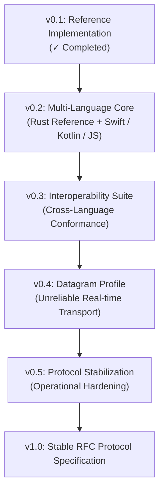

# Knot Protocol Roadmap

This document outlines the protocol maturity roadmap and design extension guidelines for **Knot Protocol (v1)**. It defines the path from the current reference implementation to a stable, multi-language, and interoperable protocol ecosystem.

---

## 1. Protocol Maturity Stages



### 🟩 v0.1: Reference Implementation (Current)
*   **Goal:** Establish a correct, spec-aligned Rust library with comprehensive unit and conformance integration tests.
*   **Deliverables:**
    *   [x] Standardised object model specs (Session, Knot, Rope, Topic).
    *   [x] Verified bidirectional handshakes & cryptographically enforced `node_id` validation.
    *   [x] Enforced stream gating (`StreamOpen` -> `StreamAccepted`).
    *   [x] 8 passing integration conformance tests over real Iroh loopback transport.
    *   [x] Initial `docs/RATIONALE.md` and `docs/COMPLIANCE.md`.

### 🟨 v0.2: Multiple Implementations
*   **Goal:** Prove the specification's independence by building client (Rope) libraries in Swift (iOS), Kotlin (Android), and TypeScript/JavaScript (Web browsers).
*   **Key Focus:** Interoperating with the Rust Host endpoint over standard Iroh network bindings.

### 🟨 v0.3: Cross-Language Interoperability Suite
*   **Goal:** Expand `tests/conformance/` to run cross-language validation:
    *   Rust Host testing against Swift Rope.
    *   Rust Host testing against JS Rope.
    *   Validating that all implementations conform strictly to the 28-byte binary layout and envelope bincode framing.

### 🟨 v0.4: Low-Latency Datagram Profile
*   **Goal:** Implement and test the unreliable datagram transport profile for media streaming, ensuring UDP packet fragmentation, assembly, and out-of-order sequence index handling conform to spec without head-of-line blocking.

### 🟨 v0.5: Protocol Hardening & Stabilization
*   **Goal:** Validate Knot under real-world network impairments (packet loss, high jitter, cellular-to-Wi-Fi handovers, and long-term sleep states).

### 🟦 v1.0: Protocol Freeze / Stable Spec
*   **Goal:** Freeze the wire format, publish the final specifications, and lock down compatibility promises.

---

## 2. IANA-Style Registries & Ranges

To avoid namespace conflicts and facilitate clean extensibility, Knot defines designated registry identifiers and range-allocation rules.

### Message Type Ranges (`Envelope.payload` variants)
All control message serialization identifiers (or numeric enum discriminants in binary modes) are grouped by these ranges:

| Range | Domain | Description |
| :--- | :--- | :--- |
| **`0 - 999`** | **Core Protocol** | Essential orchestration envelopes (`Tie`, `Welcome`, `Reject`, `StreamOpen`, `StreamAccepted`, `Ack`, `Goodbye`, `Ping`, `Pong`) |
| **`1000 - 1999`** | **Media Extensions** | Stream-control additions (resolution changes, keyframe requests, dynamic codec updates) |
| **`2000 - 2999`** | **IoT / Sensor Extensions** | Local orchestration profiles (Matter / Zigbee encapsulation mapping, generic telemetry events) |
| **`3000 - 3999`** | **Experimental** | Private/dev branches. Must not be used in stable public releases |
| **`4000+`** | **Vendor-Specific** | Application-specific extensions (e.g. AMOS or SEYFR custom control events) |

---

## 3. Extension Policies

Contributors adding custom features to the Knot ecosystem MUST adhere to these rules:

1.  **Prefer Application-Level Envelopes:** If a feature can be implemented using the generic `ControlMessage::Event` or `ControlMessage::Command` envelopes by passing custom payload strings, it **MUST NOT** be added as a core protocol control message.
2.  **Optional Fields Only:** Minor updates (e.g. v1.1) may only append optional fields. New fields must default to None/Default if missing to ensure backward compatibility.
3.  **ALPN Separation for Breaking Upgrades:** Any change that reorganizes the 28-byte frame header or changes the layout of existing core message types is a breaking change and requires updating the protocol ALPN string (e.g. `jitpomi/studio/2`).

---

## 4. Transport Abstraction & Pluggable Adapter Interface (Roadmap)

To ensure maximum flexibility and ease of integration, future iterations of the Rust reference implementation (`knot-protocol`) will decouple the core protocol logic from the concrete Iroh engine using a **Transport Adapter Pattern**.

### 4.1 Proposed Adapter Trait Design
Instead of referencing `iroh::Endpoint` directly, `KnotClient` and `KnotHub` will consume swappable traits representing the network transport capability:

```rust
#[async_trait]
pub trait KnotTransport {
    type Connection: KnotConnection;
    async fn connect(&self, ticket: &str) -> Result<Self::Connection>;
    async fn accept(&self) -> Result<Self::Connection>;
}

#[async_trait]
pub trait KnotConnection {
    type ControlStream: tokio::io::AsyncRead + tokio::io::AsyncWrite + Send + Unpin;
    type DataStream: tokio::io::AsyncWrite + Send + Unpin;
    
    async fn open_control_stream(&self) -> Result<Self::ControlStream>;
    async fn accept_control_stream(&self) -> Result<Self::ControlStream>;
    async fn open_uni_stream(&self) -> Result<Self::DataStream>;
    async fn accept_uni_stream(&self) -> Result<Self::DataStream>;
    fn remote_node_id(&self) -> String;
}
```

### 4.2 Swappable Implementations
By defining this transport boundary, developers can plug in alternative network backends tailored to their environments:
*   **`IrohTransport` (Default):** The standard P2P connection engine with NAT traversal and relaying.
*   **`TcpTlsTransport`:** A lightweight, direct TCP/TLS implementation for local intranets or fixed cloud server topologies where hole-punching is not required.
*   **`WebRtcTransport`:** Designed for WASM target environments to allow web clients to join sessions.
*   **`MockTransport`:** A pure, in-memory transport implementation for high-speed unit testing of coordination logic without network sockets.
