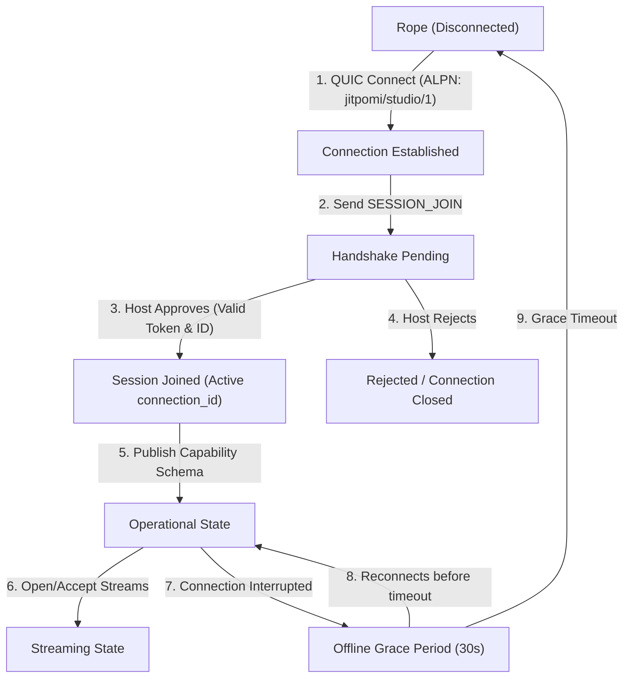

# Knot Protocol v1 Specification: Session Orchestration

This document defines the object model, terminologies, identities, and lifecycle of the **Knot Protocol (v1)**. Knot v1 is scoped strictly as a **session orchestration protocol** designed to coordinate multiple physical devices acting as a single coordinated logical participant over direct P2P connections.

---

## 1. Object Model & Metaphor

The Knot Protocol coordinates distributed components of a session. It organizes network entities according to a session-first hierarchy:

```
+-------------------------------------------------------------+
| Session (Coordination Lifetime)                             |
|   |                                                         |
|   +---> orchestrates Knots (Logical Groupings)              |
|           |                                                 |
|           +---> contains Ropes (Physical Devices)           |
|                   |                                         |
|                   +---> exposes Capabilities                |
|                   +---> maintains State                     |
|                   +---> publishes Streams                   |
|                   +---> receives Commands                   |
|                           |                                 |
|                           +---> Stream carries Frames       |
+-------------------------------------------------------------+
```

### 1.1 Object Class Definitions

* **Session:** The global lifetime, authorization, and configuration context. A session spans one Host and a set of coordinated Knots.
* **Knot:** A logical containment zone (e.g., `"driveway"`, `"zone-A"`) under which physical devices register. A Knot represents a logical entity inside a session.
* **Rope:** A physical device (e.g., camera, floodlight, gate actuator) participating in a Knot. It holds a permanent identity and temporary connection session credentials.
* **Capability:** A typed declaration of what a Rope can do, what formats it supports, and what commands it accepts.
* **State:** The dynamic, runtime properties maintained by a Rope (e.g., `"brightness: 80%"` or `"status: locked"`).
* **Stream:** An active unidirectional logical data channel published by a Rope to carry payload data.
* **Frame:** A single unit of time-indexed binary or metadata payload carried inside a Stream.

---

## 2. Terminology & Identity Definitions

To resolve ambiguities surrounding identity and connection tracking, the protocol defines three distinct, formal identifiers:

1. **`node_id` (Cryptographic Endpoint Key):**
   * The permanent cryptographic Ed25519 Public Key of the underlying physical Iroh/QUIC node.
   * Derived directly from the transport layer. The Host MUST compare the announced node_id in the SessionJoin envelope against the authenticated remote node public key of the Iroh connection.
2. **`rope_id` (Stable Device Identity):**
   * A stable, persistent, logical device identifier chosen by the client or provisioned once by the Host and saved locally on the device (e.g. UUID, MAC-based address, or hardware serial).
   * Uniquely identifies a physical piece of hardware across reboots, network changes, and reconnection events.
3. **`connection_id` (Temporary Connection Instance):**
   * A transient connection session identifier generated by the Host upon a successful handshake.
   * Unique per active QUIC connection session. Discarded immediately upon connection termination.

---

## 3. High-Level Connection & Join Lifecycle

A physical Rope connects to the Host using an Iroh ticket, negotiates transport capabilities, and formally requests admission into the session.



### 3.1 Session Join Phase
1. **Transport Link:** Rope opens a QUIC connection to the Host.
2. **Handshake Command:** Over the bidirectional control channel stream, the Rope writes a `SESSION_JOIN` command containing its `rope_id`, `node_id`, and `join_token`.
3. **Registry Binding:** If approved, the Host generates a `connection_id`, maps the `rope_id` to its logical `Knot` registry entry, and responds with a `Welcome` packet.

### 3.2 Dynamic Stream Setup
1. **Negotiation:** The Rope registers its `Capabilities` table.
2. **Stream Allocation:** The Rope requests to open a stream. Once accepted via `STREAM_ACCEPT` on the control channel, the Rope opens a unidirectional QUIC stream and writes the configuration and binary frames.
