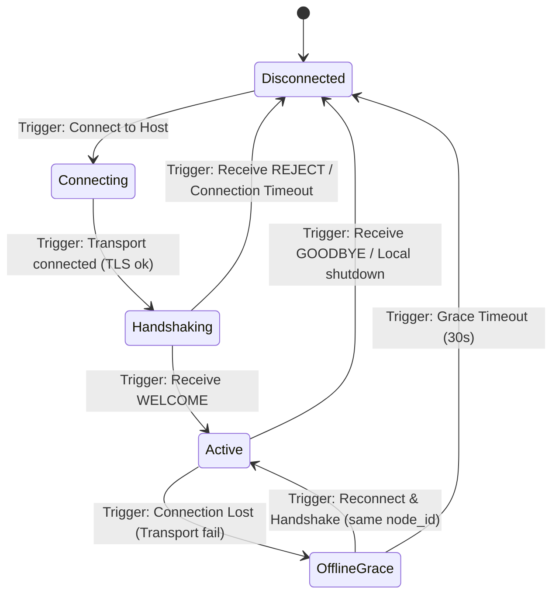
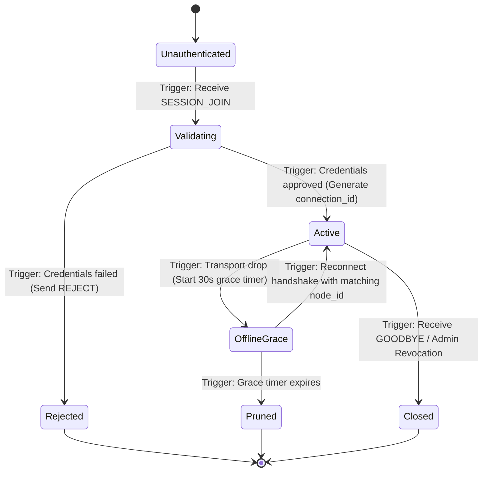
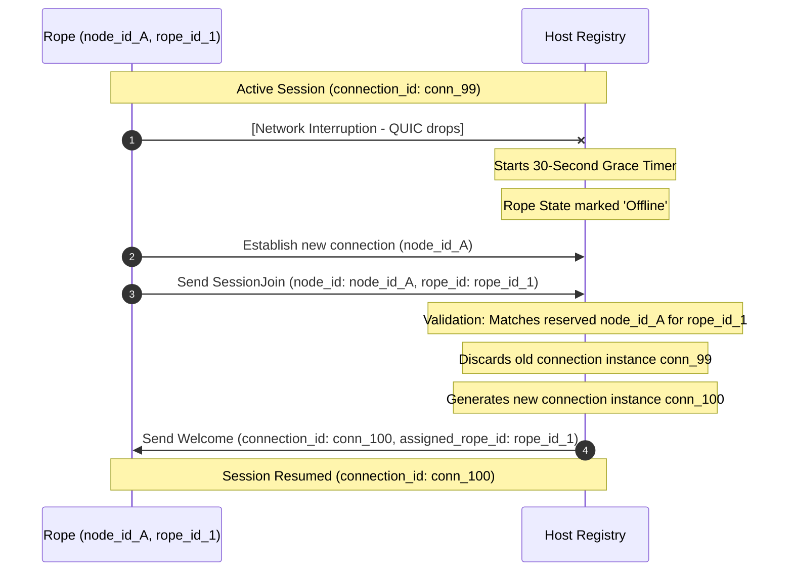

# Knot Protocol v1 State Machine Specification

This document details the formal state machines, transition rules, triggers, and reconnection workflows for Ropes (clients) and the Host (server) in the **Knot Protocol (v1)**.

---

## 1. Rope Client State Machine

A physical Rope device progresses through the following states during its lifetime in a session:

### 1.1 Rope States Definition

* **`Disconnected`:** The device has no active network association or socket.
* **`Connecting`:** Opening a QUIC endpoint to the Host address.
* **`Handshaking`:** Transport connection opened. The Rope has sent `SessionJoin` and is waiting for validation.
* **`Active`:** The Rope is successfully joined to the session with a registered `connection_id`. It can now register capabilities, handle commands, and publish streams.
* **`OfflineGrace`:** The connection was broken abruptly. The Rope is actively trying to reconnect to resume its session using the same `rope_id` and `node_id`.

---

## 2. Host Connection & Registry State Machine

The Host tracks each registered Rope using its logical registry states. Transitions are triggered by control messages and transport-layer events:

### 2.1 Host Registry State Transitions

| Source State | Trigger Event | Guard / Condition | Action | Next State |
| :--- | :--- | :--- | :--- | :--- |
| **Unauthenticated** | QUIC Connection Opened | ALPN matches `jitpomi/studio/1` | Accept bidirectional control stream | **Validating** |
| **Validating** | Receive `SessionJoin` | Token signature and `sub == node_id` matches | Generate `connection_id`, register Rope, send `Welcome` | **Active** |
| **Validating** | Receive `SessionJoin` | Token signature or `sub` check fails | Send `Reject` packet, close stream | **Rejected** |
| **Active** | Transport connection dropped | - | Mark status as `Offline`, start 30s grace timer | **OfflineGrace** |
| **OfflineGrace** | Receive `SessionJoin` | Reconnecting `node_id` matches the registered `node_id` | Terminate old `connection_id`, bind new `connection_id`, send `Welcome` | **Active** |
| **OfflineGrace** | Receive `SessionJoin` | Reconnecting `node_id` does NOT match the registered `node_id` | Send `Reject` with `DuplicateRopeId` | **OfflineGrace** |
| **OfflineGrace** | Grace timer expires (30s) | - | Delete Rope and streams from Host registry | **Pruned** |
| **Active** | Receive `Goodbye` | - | Perform cleanup, close connection | **Closed** |

---

## 3. Reconnection Sequence Diagram

This diagram outlines how a Rope gracefully recovers from a temporary connection drop, maintaining its stable logical `rope_id` while transitioning to a new `connection_id`.

