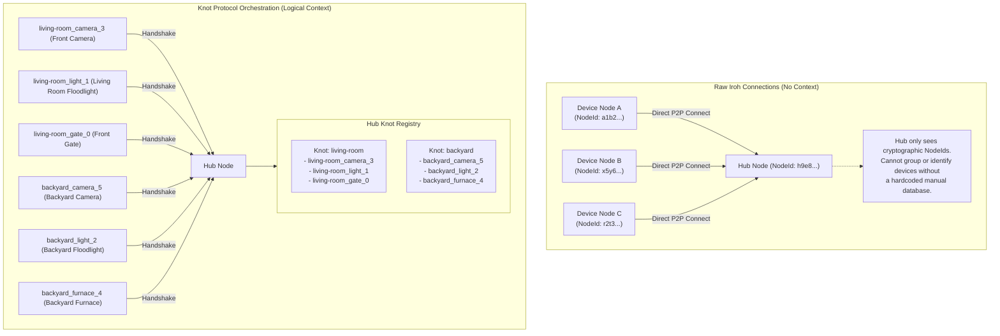

# Knot Protocol Smart Home Examples

These examples simulate a local-first smart home ecosystem built on top of the Iroh peer-to-peer (P2P) network.

## The Problem and Solution

### The Problem
Most smart home devices depend on central cloud servers to communicate. If you want to unlock a gate when a camera detects motion, that request must travel to a remote cloud database first. This results in latency, privacy risks, and total failure if your internet connection goes down.

### The Solution
The Knot Protocol and Iroh remove the cloud database layer entirely:
1. **Iroh** establishes direct, secure peer-to-peer connections between devices locally.
2. **Knot Protocol** groups these physical connections (Ropes) under a single logical identity (a Knot, representing a zone or room like "Driveway"). This allows a central coordinator (Hub) to orchestrate automatic responses locally with sub-millisecond latency.

### Why We Need the Knot Protocol (Knot vs. Raw Iroh)

Without the Knot Protocol, Iroh only provides raw peer-to-peer connections:
* **No Context:** The Hub only sees connections identified by raw cryptographic keys (e.g. `NodeId: 5b7ba7a3...`). It does not know what room a device is in, what type of device it is, or how to route events to it.
* **Brittle Configurations:** You would have to manually hardcode a database on the Hub mapping hardware keys to rooms. If a device is moved, replaced, or upgraded, the Hub's configuration breaks.

The Knot Protocol solves this by adding a logical orchestration layer:
* **Logical Self-Registration:** Devices (Ropes) dynamically report their room (`knot_id`) and capability (`rope_type`) during the connection handshake.
* **Unified Logical Identity:** The Hub dynamically groups multiple physical connections under a single logical room group (a Knot). This allows routing automation commands locally and selectively to the correct room without managing hardware-specific keys.

### Comparison Diagram



---

## Running the Example

### Coordinated Smart Home Suite
* **File:** [smart_home.rs](smart_home.rs)
* **Description:** Runs a complete multi-device smart home suite concurrently, demonstrating local P2P coordination across different rooms (Knots). When a camera detects motion, the hub automatically dispatches events to the correct devices in the same room (e.g., unlocking gates, dimming floodlights, or turning furnaces on).
* **Run command:**
  ```bash
  cargo run --example smart_home
  ```

---

## Execution Walkthrough

When you run the simulation, you will observe the following step-by-step sequence in the console:

### 1. Devices register under their respective rooms (Knots)
All devices connect and announce their room (Knot ID) to the Hub:
* **living-room Knot:**
  * living-room_gate_0 (Front Gate Lock)
  * living-room_light_1 (Living Room Floodlight)
  * living-room_camera_3 (Front Camera)
* **backyard Knot:**
  * backyard_light_2 (Backyard Floodlight)
  * backyard_furnace_4 (Backyard Furnace)
  * backyard_camera_5 (Backyard Camera)

### 2. Scenario 1: Motion in the living-room
The Front Camera streams frames, then sends a "motion_detected" event to the Hub:
* **Hub Actions:**
  * `[HUB] Motion detected in Knot 'living-room'! Orchestrating local responses...`
  * `[HUB] -> Instructing Floodlight 'living-room_light_1' to adjust dimming level to 100%`
  * `[HUB] -> Instructing Gate lock 'living-room_gate_0' to UNLOCK`
* **Result:** The Living Room Floodlight turns on to 100% and the Gate unlocks:
  * `[LIGHT (Living Room Floodlight)] Brightness adjusted to 100%!`
  * `[GATE] Action Executed: Gate set to UNLOCK successfully!`
* **Backyard Status:** The backyard floodlight and furnace are completely unaffected.

### 3. Scenario 2: Motion in the backyard
Next, the Backyard Camera streams frames and sends a "motion_detected" event:
* **Hub Actions:**
  * `[HUB] Motion detected in Knot 'backyard'! Orchestrating local responses...`
  * `[HUB] -> Instructing Backyard Light 'backyard_light_2' to turn OFF`
  * `[HUB] -> Instructing Furnace 'backyard_furnace_4' to turn ON`
* **Result:** The Backyard Floodlight is dimmed to 0% (turned off), and the Backyard Furnace is turned on:
  * `[FURNACE (Backyard Furnace)] State adjusted: set to ON successfully!`
  * `[LIGHT (Backyard Floodlight)] Brightness adjusted to 0%!`
* **Living Room Status:** The living-room devices are completely unaffected.

### Key Takeaway
Both rooms are completely isolated from each other. The Hub dynamically routes different automation logic (unlocking gates vs. firing up furnaces and switching lights off) based on the specific Knot where the motion event occurred.

